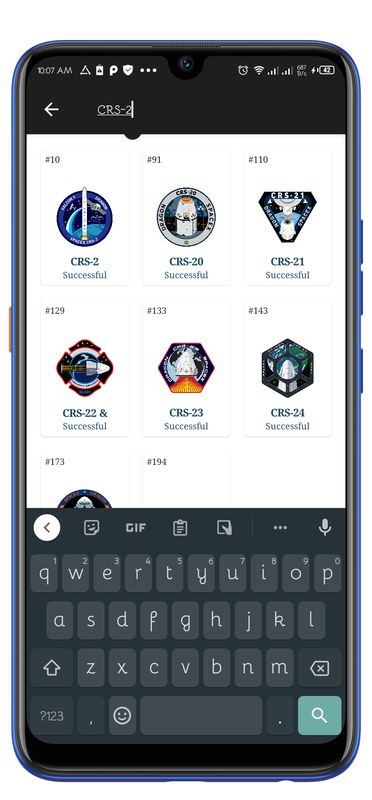
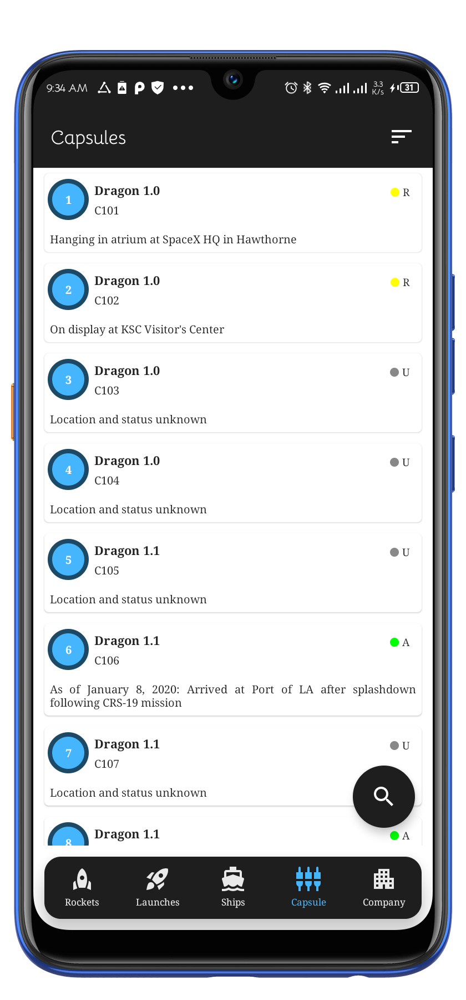
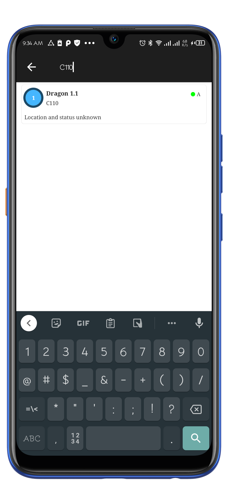
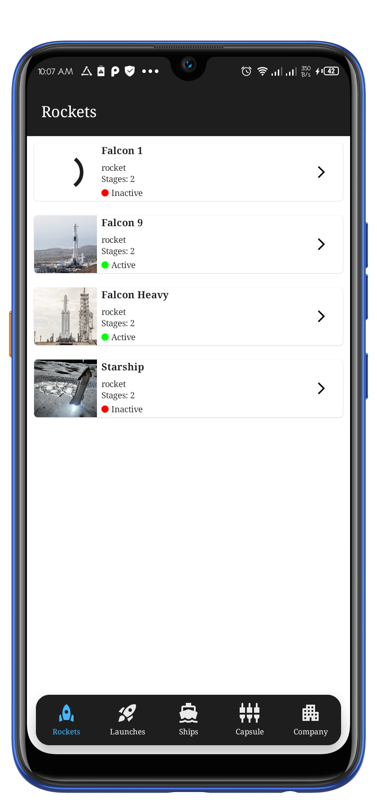

# Space X Go  🚀 
Space X Go is an android app built using Kotlin that consumes [Space X API](https://github.com/r-spacex/SpaceX-API) to display rockets, ships, launches and Space X company information. It has been built following Clean Architecture Principle, Repository Pattern, MVVM Architecture in the presentation layer as well as Jetpack components. Some of the features are Launch tracking & other details.

## Table Of Content.

- [Prerequisite](#prerequisite)
- [Architecture](#architecture)
    - [What is Clean Architecture](##why-clean-architecture)
    - [Why Clean Architecture](##why-clean-architecture)
    - [Layers](##layers)
        - [Domain](###domain)
        - [Data](###data)
        - [Presentation](###presentation)
- [Tech Stack](#techstack)
    - [Libraries](##libraries)
- [Helpful Resources](#helpful-resources)
- [Screenshots](#screenshots)

## Prerequisite.
To get the application, run the following command on your terminal `https://github.com/robert-muriithi/SpaceXGo.git` or open android studio and create a new project from version control and paste `https://github.com/robert-muriithi/SpaceXGo.git`


> NOTE: Using complex architecture such as clean architecture may result in increased code complexity due to the need for multiple data transformations (mappers) and models to maintain decoupling. This can steepen the learning curve and make the code harder to understand. This repository implements the clean architecture solely to demonstrate my proficiency, and it is not recommended for small scale projects like this one, where a simpler approach such as MVVM may be more suitable

## Architecture.

### What is Clean Architecture?
Clean Architecture is a software design approach that aims to decouple the various components of an application to improve its maintainability, testability, and scalability. It does so by organizing the code into concentric circles, with the innermost layer being the core of the application and the outer layers handling increasingly abstract concerns such as the presentation and persistence of data. This helps to maintain separation of concerns and keep the codebase organized, even as the application grows in size and complexity.

Clean architecture was introduced by Robert C. Martin in 2012. Read [Clean Code Blog](http://blog.cleancoder.com/uncle-bob/2012/08/13/the-clean-architecture.html). It follows the SOLID principles, which are a set of guidelines for writing maintainable and scalable software.

<p align="center"></p>

### Why Clean Architecture?
- Improved separation of concerns: Clean architecture helps to maintain a clear separation between different components of an application, making it easier to understand and modify.
- Increased maintainability: By keeping code organized and decoupled, it becomes easier to modify and maintain over time.
- Better testability: Clean architecture encourages writing tests for each component in isolation, making it easier to validate the functionality of individual parts of the codebase.
- Improved scalability: The modular nature of clean architecture makes it easier to add new features and extend the codebase as the application grows in size and complexity.
- Better adaptability: Clean architecture helps to make an application more flexible and adaptable to change, as different components can be modified or replaced without affecting the rest of the codebase.

## Layers.

### 1. Domain.
This is the core layer of the application. The ```domain``` layer is independent of any other layers thus ] domain models and business logic can be independent from other layers.This means that changes in other layers will have no effect on domain layer eg.  screen UI (presentation layer) or changing database (data layer) will not result in any code change withing domain layer.

Components of domain layer include:
- __Models__: Defines the core structure of the data that will be used within the application.

- __Repositories__: Interfaces used by the use cases. Implemented in the data layer.

- __Use cases/Interactors__: They enclose a single action, like getting data from a database or posting to a service. They use the repositories to resolve the action they are supposed to do. They usually override the operator “invoke”, so they can be called as a function.

### 2. Data.
The ```data``` layer is responsibile for selecting the proper data source for the domain layer. It contains the implementations of the repositories declared in the domain layer. 

Components of data layer include:
- __Models__

    -__Dto Models__: Defines POJO of network responses.

    -__Entity Models__: Defines the schema of SQLite database.

- __Repositories__: Responsible for exposing data to the domain layer.

- __Mappers__: They perform data transformation between ```domain```, ```dto``` and ```entity``` models.

- __Network__: This is responsible for performing network operations eg. defining API endpoints using [Retrofit](https://square.github.io/retrofit/).

- __Cache__: This is responsible for performing caching operations using [Room](https://developer.android.com/training/data-storage/room).

- __Data Source__:  Responsible for deciding which data source (network or cache) will be used when fetching data.

### 3. Presentation.
The ```presentation``` layer contains components involved in showing information to the user. The main part of this layer are the views(activity and fragments) and viewmodels.

# Tech Stack.
This project uses many of the popular libraries, plugins and tools of the android ecosystem.

- [Kotlin](https://developer.android.com/kotlin) - Kotlin is a programming language that can run on JVM. Google has announced Kotlin as one of its officially supported programming languages in Android Studio; and the Android community is migrating at a pace from Java to Kotlin.
- Jetpack components:
    - [Jetpack Compose](https://developer.android.com/jetpack/compose) - Jetpack Compose is Android’s modern toolkit for building native UI. It simplifies and accelerates UI development on Android. Quickly bring your app to life with less code, powerful tools, and intuitive Kotlin APIs.
    - [Android KTX](https://developer.android.com/kotlin/ktx.html) - Android KTX is a set of Kotlin extensions that are included with Android Jetpack and other Android libraries. KTX extensions provide concise, idiomatic Kotlin to Jetpack, Android platform, and other APIs.
    - [AndroidX](https://developer.android.com/jetpack/androidx) - Major improvement to the original Android [Support Library](https://developer.android.com/topic/libraries/support-library/index), which is no longer maintained.
    - [Lifecycle](https://developer.android.com/topic/libraries/architecture/lifecycle) - Lifecycle-aware components perform actions in response to a change in the lifecycle status of another component, such as activities and fragments. These components help you produce better-organized, and often lighter-weight code, that is easier to maintain.
    - [ViewModel](https://developer.android.com/topic/libraries/architecture/viewmodel) -The ViewModel class is designed to store and manage UI-related data in a lifecycle conscious way.
    - [LiveData](https://developer.android.com/topic/libraries/architecture/livedata) - LiveData is an observable data holder class. Unlike a regular observable, LiveData is lifecycle-aware, meaning it respects the lifecycle of other app components, such as activities, fragments, or services. This awareness ensures LiveData only updates app component observers that are in an active lifecycle state.
    - [Room database](https://developer.android.com/training/data-storage/room) - The Room persistence library provides an abstraction layer over SQLite to allow fluent database access while harnessing the full power of SQLite.
    - [Preferences DataStore](https://developer.android.com/topic/libraries/architecture/datastore) - Jetpack DataStore is a data storage solution that allows you to store key-value pairs or typed objects with protocol buffers. DataStore uses Kotlin coroutines and Flow to store data asynchronously, consistently, and transactionally.
  
- [Kotlin Coroutines](https://developer.android.com/kotlin/coroutines) - A concurrency design pattern that you can use on Android to simplify code that executes asynchronously.
- [Retrofit](https://square.github.io/retrofit) -  Retrofit is a REST client for Java/ Kotlin and Android by Square inc under Apache 2.0 license. Its a simple network library that is used for network transactions. By using this library we can seamlessly capture JSON response from web service/web API.
- [GSON](https://github.com/square/gson) - JSON Parser,used to parse requests on the data layer for Entities and understands Kotlin non-nullable and default parameters.
- [Kotlin Flow](https://developer.android.com/kotlin/flow) - In coroutines, a flow is a type that can emit multiple values sequentially, as opposed to suspend functions that return only a single value.
- [Dagger Hilt](https://developer.android.com/training/dependency-injection/hilt-android) - A dependency injection library for Android that reduces the boilerplate of doing manual dependency injection in your project.
- [Ramcosta Navigation Library](https://composedestinations.rafaelcosta.xyz/) - A KSP library that processes annotations and generates code that uses Official Jetpack Compose Navigation under the hood. It hides the complex, non-type-safe and boilerplate code you would have to write otherwise.
- [Logging Interceptor](https://github.com/square/okhttp/blob/master/okhttp-logging-interceptor/README.md) -  logs HTTP request and response data.
- [Coil](https://coil-kt.github.io/coil/compose/)- An image loading library for Android backed by Kotlin Coroutines.
- [Timber](https://github.com/JakeWharton/timber)- A logger with a small, extensible API which provides utility on top of Android's normal Log class.


# Helpful Resources
In this section i've included some resources ie. articles and GitHub reposirtories that are helpful when learning about clean architecture:

1. [The clean code blog](https://blog.cleancoder.com/uncle-bob/2012/08/13/the-clean-architecture.html) by Robert C. Martin.
2. [A detailed guide on developing android apps using clean architecture pattern](https://medium.com/@dmilicic/a-detailed-guide-on-developing-android-apps-using-the-clean-architecture-pattern-d38d71e94029) Medium article.
3. [Clean Architecture Component Boilerplater](https://github.com/bufferapp/clean-architecture-components-boilerplate) GitHub repo .

# Screenshots
 
 
 
 
 

